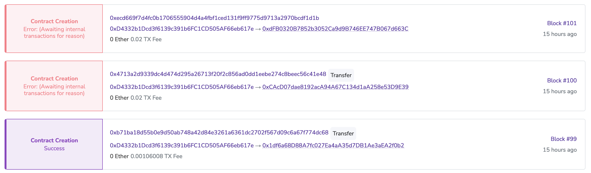
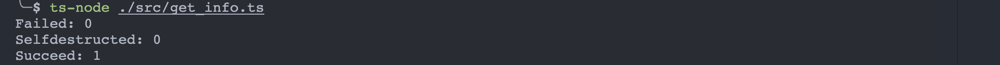
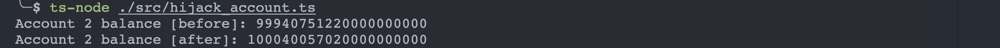
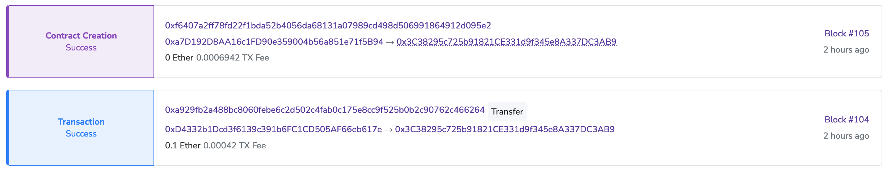

## 创建合约的一些细节

实验中参照的黄皮书版本为 `BERLIN VERSION fabef25 – 2021-12-02`

当transaction的to域为空时，该交易是一个contract creation交易，因此我们可以使用下面这种方式创建合约(该函数的实现参见[这里](https://github.com/M4tsuri/ETHacks/blob/ad2d297117c247979d822c820c3154cb7a942fd9/experiments/play/src/create_fail.ts#L19)：

```ts
await sendRawTransaction({
  nonce: nonce,
  gasPrice,
  gasLimit: 1000000,
  to: undefined,
  value: 0,
  /**
   * STOP
   * */ 
  data: "0x00",
}, testPrivKey)
```

其中value为向合约转入的金额，data（严格来说，在黄皮书中这个叫init，我们采用黄皮书的叫法）为用于**生成合约代码**的代码。一定要注意这个init本身并不是合约代码，将init中的代码在EVM中运行，生成的代码才是合约代码。

合约账户的创建分为两种类型，分别是CREATE和CREATE2，对应EVM中的两个opcode，它们的不同点在于合约地址的生成方式不同，CREATE方式创建的合约，合约地址与交易sender的地址和nonce有关，CREATE2方式创建的合约，合约地址和交易sender的地址，init代码以及一个salt值有关。

在合约账户创建过程中，我们考虑下面几个边界情况：

1. 合约创建代码init执行失败
2. 合约地址已存在

我们再定义一个交易过程中世界状态的checkpoint：

1. 交易sender的余额减去最大gas费（gasPrice * gasLimit）
2. 交易sender的nonce加一
3. 其余与交易发生前的世界状态保持一致

### 合约创建代码执行失败

init代码执行失败意味着代码的非自然结束，这种情况统称为OOG（Out-of-gas），但实际上原因可能多种多样，例如init代码中存在invalid opcode，如[这个例子](https://github.com/M4tsuri/ETHacks/blob/ad2d297117c247979d822c820c3154cb7a942fd9/experiments/play/src/create_fail.ts#L57)。无论是怎样的异常情况，只要出现异常，就会导致世界状态回退到checkpoint，这直接进一步导致：

1. 不退还任何sender的gas费
2. 合约账户不会被创建（直接表现为查询时nonce为0，如果创建成功合约账户nonce为1）

> 注意合约账户不会被创建和合约账户nonce查询为0并不冲突，因为黄皮书规定对于不存在的账户，其balance，nonce等均为0或为空

执行示例create_file.ts中的代码，我们可以看到下面结果：



可以看到，对于后两次失败的创建，我们所有的gas费都被拿走了。

进一步验证合约账户是否成功创建，在示例get_info.ts中，我们获取三种账户的nonce，分别是合约创建失败“产生”的账户，自毁的账户以及创建成功的账户，运行结果如下：



可以看到，一切正如我们假设的那样。

### 合约地址已存在

这是一个很奇怪的边界情况，因为合约地址已存在的情况实在是太难想到了。但是黄皮书仍然对此做了详细的形式化定义。对于下面这两种情况，我们视为异常，处理措施与合约创建代码执行失败时相同（对应黄皮书式105）

1. 该地址是一个合约地址，即`codeHash != KEC(())`
2. 该地址是一个EOA，**并且**有过交易，即`nonce != 0`

注意我们这里出现了一种好玩的情况，即该地址是一个EOA，并且没有过交易。这种情况下我们的新的合约账户会继承它的“遗产”，即**覆盖该账户并继承它的余额**。

我们可以根据这个行为做一个小实验（在hijack_account.ts）：

```ts
    // we will create an EOA with acc1, and acc2 will create a contract to hijack the EOA created by acc1
    const acc1 = web3.eth.accounts.privateKeyToAccount("f92208ac8d6a14401d8a3268609f2b5a84c767a37d231eb73c862dd0e4f91b48")
    const acc2 = web3.eth.accounts.privateKeyToAccount("30b51f010baa4496d2bf8f29d1a5e9c12c82833d48fa326d763d8345ed98604d")
    
    // 1. calculate the EOA address
    const acc2_nonce = toBN(await web3.eth.getTransactionCount(acc2.address));
    const acc2_addr = toBN(acc2.address)
    const encoded = rlp.encode([acc2_addr, acc2_nonce])
    const addr = bufferToHex(keccak256(encoded).slice(12, 32));
    await web3.eth.sendTransaction({
        from: acc1.address,
        to: addr,
        // send 0.1 eth
        value: toWei("0.1", "ether"),
    })

    // 2. acc2 create a contract
    console.log(`Account 2 balance [before]: ${await web3.eth.getBalance(acc2.address)}`)
    await web3.eth.sendTransaction({
        from: acc2.address,
        to: undefined,
        data: "6080604052348015600f57600080fd5b503373ffffffffffffffffffffffffffffffffffffffff16fffe",
        value: 0
    })
    console.log(`Account 2 balance [after]: ${await web3.eth.getBalance(acc2.address)}`)
```

上面的代码做了两件事：

1. 账户一根据账户二的地址和nonce计算出了账户二下一次部署合约时合约的地址（计算方法参见黄皮书式81-83）并往该地址发送了0.01 ether
   > 虽然这个地址并不存在于世界状态中，但是黄皮书的式112保证了该地址会作为一个非合约地址被创建（初始nonce为0）
2. 账户二创建合约，合约内容如下（contract/cover.sol）：
   ```
   contract Cover {
      constructor() {
        selfdestruct(payable(msg.sender));
      }
   }
   ```
   该合约会在合约创建阶段自毁，并将余额发送给创建者（这里是账户二）

通过上面的操作，我们成功在账户一和二之间实现了没有第三方介入的间接转账（just for fun）。

我们的代码执行结果如下：



我们可以在区块浏览器中看到这个转账的过程：


   

